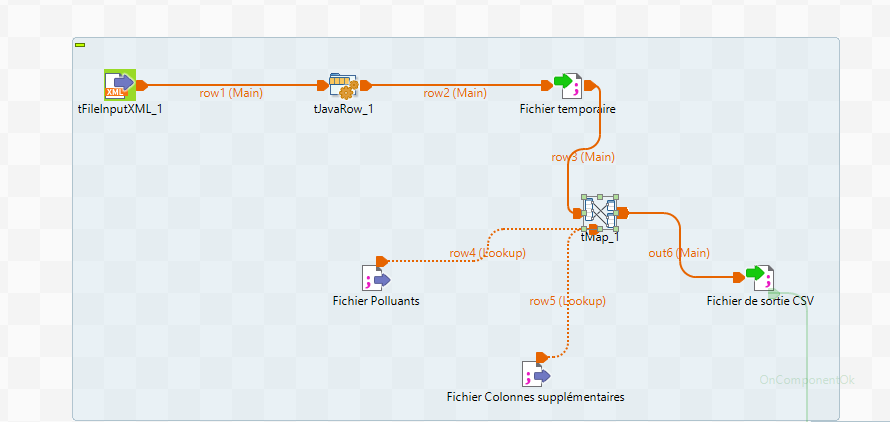

# Projet-File-Rouge
Surveillance et Prédiction de la qualité de l’air dans la Région Auvergne-Rhône-Alpes​

Dans le cadre d'une formation aux métiers de « data analyst » sur une période de 3 mois, notre équipe a pris  en charge la réalisation du cas d’usage opérationnel des données. 
L'equipe est composée 3 stagaires, "Data Analysts juniors", disposant de compétences sur la gestion des bases de données, la création de dashboards (datavisualisation), et la conceptualisation des modèles de machine learning.

Pendant 8 semaines on s’est lancée dans une démarche pédagogique et expérimentale sur la réalisation d’un prototype de réutilisation de données présentes en open data.  
Cette démarche vise à présenter des leviers d’amélioration de la qualité de l’air avec  :

- Un dashboard sur la qualité de l’air en Auvergne Rhonalpes, entre 2018 et 2024.
- Un modèle de machine learning (Régression et classification).

## Source de données
### Fichier CSV
Les données ont été colléctés à partir de [https://www.data.gouv.fr/fr/datasets/donnees-temps-reel-de-mesure-des-concentrations-de-polluants-atmospheriques-reglementes-1/].

Un premier Script applé [scraping_data.py](./Notebook/scraping_data.py) sert à télécharger les fichier csv en local. Ces données CSV sont des données relatievement récents qui date de 2021 à 2024.
Ces données d’observation accessibles sur le site [http://data.gouv.fr] sont issues de la surveillance réglementaire de la qualité de l’air. Elles décrivent les concentrations moyennes horaires des polluants réglementés surveillés par des appareils de mesure automatiques installés sur des stations fixes.

Exemple de ficheirs CSV: 


```
Date de début;Date de fin;Organisme;code zas;Zas;code site;nom site;type d'implantation;Polluant;type d'influence;discriminant;Réglementaire;type d'évaluation;procédure de mesure;type de valeur;valeur;valeur brute;unité de mesure;taux de saisie;couverture temporelle;couverture de données;code qualité;validité
2021/10/22 00:00:00;2021/10/22 01:00:00;ATMO GRAND EST;FR44ZAG02;ZAG METZ;FR01011;Metz-Centre;Urbaine;NO;Fond;A;Oui;mesures fixes;Auto NO Conf meth CHIMILU;moyenne horaire validée;1.1;1.1;µg-m3;;;;A;1
2021/10/22 01:00:00;2021/10/22 02:00:00;ATMO GRAND EST;FR44ZAG02;ZAG METZ;FR01011;Metz-Centre;Urbaine;NO;Fond;A;Oui;mesures fixes;Auto NO Conf meth CHIMILU;moyenne horaire validée;0.8;0.8;µg-m3;;;;A;1
2021/10/22 02:00:00;2021/10/22 03:00:00;ATMO GRAND EST;FR44ZAG02;ZAG METZ;FR01011;Metz-Centre;Urbaine;NO;Fond;A;Oui;mesures fixes;Auto NO Conf meth CHIMILU;moyenne horaire validée;;;µg-m3;;;;N;-1
2021/10/22 03:00:00;2021/10/22 04:00:00;ATMO GRAND EST;FR44ZAG02;ZAG METZ;FR01011;Metz-Centre;Urbaine;NO;Fond;A;Oui;mesures fixes;Auto NO Conf meth CHIMILU;moyenne horaire validée;1.7;1.7;µg-m3;;;;A;1
2021/10/22 04:00:00;2021/10/22 05:00:00;ATMO GRAND EST;FR44ZAG02;ZAG METZ;FR01011;Metz-Centre;Urbaine;NO;Fond;A;Oui;mesures fixes;Auto NO Conf meth CHIMILU;moyenne horaire validée;2.7;2.725;µg-m3;;;;A;1
2021/10/22 05:00:00;2021/10/22 06:00:00;ATMO GRAND EST;FR44ZAG02;ZAG METZ;FR01011;Metz-Centre;Urbaine;NO;Fond;A;Oui;mesures fixes;Auto NO Conf meth CHIMILU;moyenne horaire validée;11.1;11.05;µg-m3;;;;A;1
2021/10/22 06:00:00;2021/10/22 07:00:00;ATMO GRAND EST;FR44ZAG02;ZAG METZ;FR01011;Metz-Centre;Urbaine;NO;Fond;A;Oui;mesures fixes;Auto NO Conf meth CHIMILU;moyenne horaire validée;7.9;7.9;µg-m3;;;;A;1
```


### Fichier XML

Ces des fichiers historiques qui datent de 2018 à 2020. Ces fichiers  ne sont pas as autoporteurs. Il doivent être interprétés à l’aide de données référentielles qui permettent la caractérisation précise de la mesure : localisation de la station, typologie de la station et du point de prélèvement, méthode de mesure utilisée, dates de fonctionnement… Ces informations sont contenues dans deux fichiers annexes, également téléchargeables sur le site et nommés « dataset B » et « dataset D ».

Deux [fichiers de mapping](https://github.com/MALEKHAJJEM/Projet-File-Rouge/tree/main/Fichier%20de%20Mapping) ont été creer pour une utilisation ultérieurs 

Pour lire et extraires les données à partir de ces fichiers en structure XML, nous avons utilisé un job parent 

1. Parent job:
   
-  Récupérer la liste des fichiers : tfileFetch : le but est de télécharger la liste de tous les fichiers d'une année donnée à partir de [https://files.data.gouv.fr/lcsqa/concentrations-de-polluants-atmospheriques-reglementes/old/].
*  Faire une pause le temps de faire une manipulation manuel pour enlever la balise "hr" qui bloque Talend.
+ Lecture 2020.xml ligne par ligne (chaque <a>) (les nom des fichier xml): TfileinputXML
- Stocker l'URL dans une variable à l'aide tjavaRow1( on garde que les fichier verifier)
- Télécharger les fichiers (tFileFetch) permet de télécharger fichier par fichier à partir des liste.
- Une fois les telechargements sont faites, on passe à Tfileliste qui appelle un Child job 

2. Child job:
- Lire chaque fois le XML input
- Extraire les premières colonnes à travers TJavaRow 
- Ecrire dans un fichier temporaire pour faciliter TfileoutputDelimiter
- Mapper le fichier avec Tmap pour extraire les colones necessiares à travers Tmap en utilisant les fichier de mapping précedement construits
Un exemple de résultat obtenu est présenté comme suit:
```
StartTime;EndTime;Verification;Validity;Value;polluant;localisation;ORGANISME;RelevantEmissions;typologie
2018-10-09T23:00:00+00:00;2018-10-09T24:00:00+00:00;2;1;89.3;O3;Cheiron;ATMO SUD;Fond;rural regional
2018-10-09T23:00:00+00:00;2018-10-09T24:00:00+00:00;2;1;93.3;O3;Obs Haute-Provence;ATMO SUD;Fond;rural prés de ville
2018-10-09T23:00:00+00:00;2018-10-09T24:00:00+00:00;2;1;4.0;PM2.5;Obs Haute-Provence;ATMO SUD;Fond;rural prés de ville
2018-10-09T23:00:00+00:00;2018-10-09T24:00:00+00:00;2;1;11.0;PM10;Obs Haute-Provence;ATMO SUD;Fond;rural prés de ville
2018-10-09T23:00:00+00:00;2018-10-09T24:00:00+00:00;2;1;10.0;NO2;GAP JEAN JAURES;ATMO SUD;Trafic;Urbaine
2018-10-09T23:00:00+00:00;2018-10-09T24:00:00+00:00;2;1;9.0;PM2.5;GAP JEAN JAURES;ATMO SUD;Trafic;Urbaine
2018-10-09T23:00:00+00:00;2018-10-09T24:00:00+00:00;2;1;12.0;PM10;GAP JEAN JAURES;ATMO SUD;Trafic;Urbaine
2018-10-09T23:00:00+00:00;2018-10-09T24:00:00+00:00;2;1;30.3;NO2;NICE ARSON;ATMO SUD;Fond;Urbaine
2018-10-09T23:00:00+00:00;2018-10-09T24:00:00+00:00;2;1;23.3;O3;NICE ARSON;ATMO SUD;Fond;Urbaine
2018-10-09T23:00:00+00:00;2018-10-09T24:00:00+00:00;2;1;9.0;PM2.5;NICE ARSON;ATMO SUD;Fond;Urbaine
```
## Prétraitement des données pour la machine Learning:

Cette étapes consiste à homgéniser les données obtenus afin d'avoir de données homogénes. 
### 1- Extraire les données de Auvergne rhone alpes:
script [Extraction_info_lyon.py](./Notebook/scraping_data.py).

## Exploration de données :

1. Compréhension des données
   - Chargement des données dans un Dataframe
   -Aperçu des données: (1) Utiliser head voir un échantillon des données, (2) Utiliser info() pour obtenir des informations sur les types de données et les valeurs manquantes, (3) Utiliser describe() pour obtenir des statistiques descriptives sur les colonnes numériques.
2. Nettoyage des données
  -Gestion des valeurs manquantes: Identifier les valeurs manquantes (isnull().sum()).
Décider de les supprimer 
4. Analyse univariée : Analyse des distributions de chaque variable individuellement.
Utilisation de visualisations telles que les histogrammes, les diagrammes en boîtes (box plots), et les diagrammes de densité.
5. Analyse bivariée et multivariée
a. Analyse des relations entre les variables
Utilisation de matrices de corrélation pour les variables numériques.
Visualisation des relations avec des diagrammes de dispersion, des heatmaps, des pair plots, etc.

## Feature engineering:
1. Transformation des données  
Calculer l'index de la qualité d'air pour chaque site  en 24h ainsi que la qualité d'air globale en fonction de polluants
2. Concatener les nouveau colones calculer à la Dataframe initiale


###Séparer les données trainning et test


